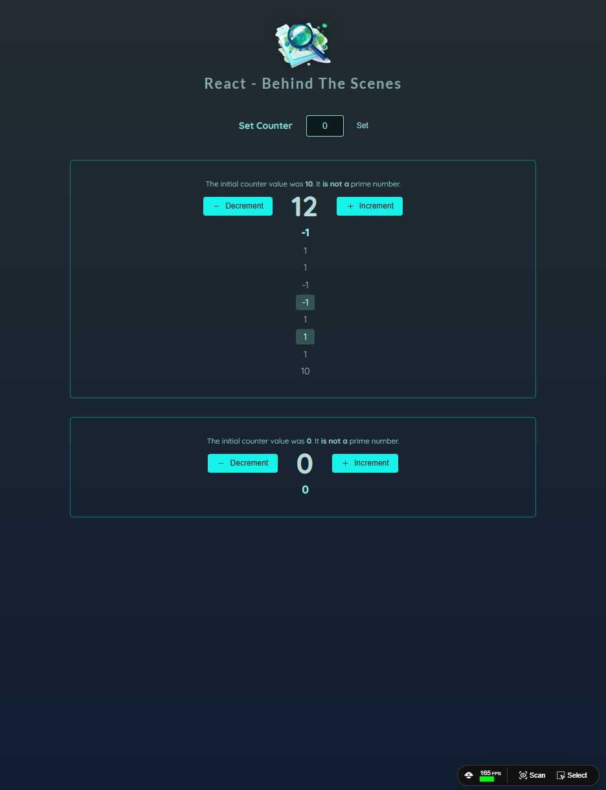

# React Behind the Scenes - Counter App

A React app that features a customizable counter with dynamic configurations, history tracking, and prime number checks. The app makes use of React hooks like useState, useEffect, useMemo, useCallback, and memo for optimal performance and state management.
<br><br>


## 🚀 Getting Started

### **Prerequisites**
Make sure you have the following installed before running the project:
- **Node.js** (Download from [nodejs.org](https://nodejs.org/))
- **npm** or **yarn** (Comes with Node.js)
<br>

### **Installation**
1. Clone this repository:
   ```sh
   git clone https://github.com/nathenpriyonggo/react-behind-scenes
   ```
2. Navigate to the directory
   ```sh
   cd react-behind-scenes
   ```
3. Install dependencies:
   ```sh
   npm install
   ```
4. Start the development server:
   ```sh
   npm run dev
   ```
5. Open ```http://localhost:5173/``` in your browser.
<br>

## 🛠️ Built With
- **React** - A JavaScript library for building user interfaces
- **Vite** - A fast build tool for modern web projects
- **React Hooks** – For managing state and side effects
<br>

## 🎮 App Features
- **Counter with Custom Value** - Users can set an initial value for the counter via an input form.
- ** Decrement/Increment Functionality** - Users can increment or decrement the counter value with the respective buttons.
- **Prime Number Check** - The app checks whether the current counter value is a prime number using useMemo.
- **History Tracking** - Tracks each change made to the counter and displays a history of previous values.
- **Responsive Design** - The app's design adjusts dynamically to various screen sizes and devices.
- **Optimized Rendering** - The app uses React hooks such as useState, useMemo, useCallback, and memo to manage performance and avoid unnecessary re-renders.
<br>

## 🖥️ Preview
<p align="center"></p>
<br>

## 📜 License
This project is open-source. Feel free to fork, modify, and expand upon it!
<br><br>


---

✨ Happy coding! 🚀
